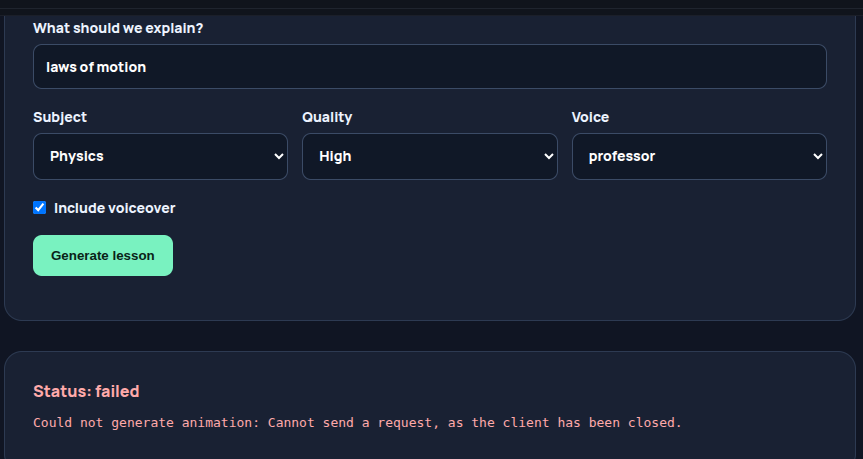

server logs 

uvicorn app.main:app --reload
INFO:     Will watch for changes in these directories: ['/home/siddhant/project/onlystudies/OnlyStudy/server']
INFO:     Uvicorn running on http://127.0.0.1:8000 (Press CTRL+C to quit)
INFO:     Started reloader process [153910] using WatchFiles
INFO:     Started server process [153930]
INFO:     Waiting for application startup.
INFO:     Application startup complete.
INFO:     127.0.0.1:47128 - "OPTIONS /api/lessons HTTP/1.1" 200 OK
INFO:     127.0.0.1:47132 - "POST /api/lessons HTTP/1.1" 202 Accepted
Direct use of automatic function calling (AFC) in Models.generate_content is not recommended. Instead, we recommend to use AFC in Chat.send_message. Similarly, direct use of AFC in Models.generate_content_stream is not recommended. Instead, we recommend to use AFC in Chat.send_message_stream.
INFO:     127.0.0.1:47132 - "GET /api/lessons/c9eeb2bb49bf4178bcb2d9aadd204217 HTTP/1.1" 200 OK

i was trying to generate a video, got these errors. fix these maybe our pipeline is not working. find the issue, implement the fixes and write all your learnings inside spec03.learning.md
