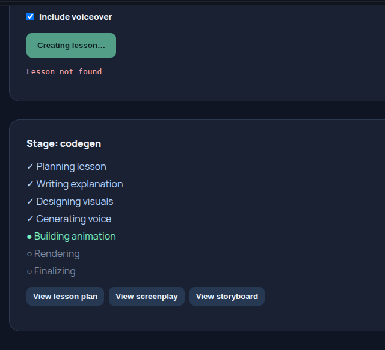
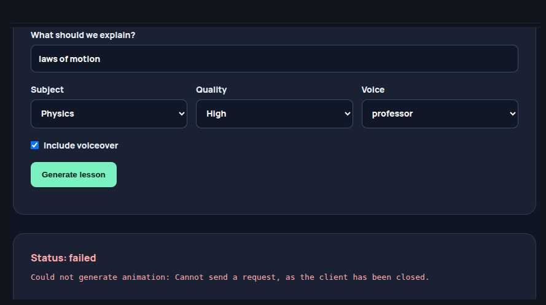

Waiting for background tasks to complete. (CTRL+C to force quit)
INFO:     Waiting for application shutdown.
INFO:     Application shutdown complete.
INFO:     Finished server process [234076]
INFO:     Started server process [240007]
INFO:     Waiting for application startup.
INFO:     Application startup complete.
INFO:     127.0.0.1:44192 - "GET /api/lessons/dbafac4cc03a462e8dd7e8c586c1cfdb HTTP/1.1" 404 Not Found
INFO:     127.0.0.1:51244 - "GET /api/lessons/dbafac4cc03a462e8dd7e8c586c1cfdb HTTP/1.1" 404 Not Found
INFO:     127.0.0.1:51238 - "GET /api/lessons/dbafac4cc03a462e8dd7e8c586c1cfdb HTTP/1.1" 404 Not Found
INFO:     127.0.0.1:42142 - "GET /api/lessons/dbafac4cc03a462e8dd7e8c586c1cfdb HTTP/1.1" 404 Not Found
INFO:     127.0.0.1:42148 - "GET /api/lessons/dbafac4cc03a462e8dd7e8c586c1cfdb HTTP/1.1" 404 Not Found
INFO:     127.0.0.1:42150 - "GET /api/lessons/dbafac4cc03a462e8dd7e8c586c1cfdb HTTP/1.1" 404 Not Found
INFO:     127.0.0.1:44192 - "GET /api/lessons/dbafac4cc03a462e8dd7e8c586c1cfdb HTTP/1.1" 404 Not Found
INFO:     127.0.0.1:51238 - "GET /api/lessons/dbafac4cc03a462e8dd7e8c586c1cfdb HTTP/1.1" 404 Not Found
INFO:     127.0.0.1:51244 - "GET /api/lessons/dbafac4cc03a462e8dd7e8c586c1cfdb HTTP/1.1" 404 Not Found
INFO:     127.0.0.1:42148 - "GET /api/lessons/dbafac4cc03a462e8dd7e8c586c1cfdb HTTP/1.1" 404 Not Found
INFO:     127.0.0.1:42142 - "GET /api/lessons/dbafac4cc03a462e8dd7e8c586c1cfdb HTTP/1.1" 404 Not Found
INFO:     127.0.0.1:42150 - "GET /api/lessons/dbafac4cc03a462e8dd7e8c586c1cfdb HTTP/1.1" 404 Not Found
INFO:     127.0.0.1:42148 - "GET /api/lessons/dbafac4cc03a462e8dd7e8c586c1cfdb HTTP/1.1" 404 Not Found
INFO:     127.0.0.1:42142 - "GET /api/lessons/dbafac4cc03a462e8dd7e8c586c1cfdb HTTP/1.1" 404 Not Found
INFO:     127.0.0.1:51238 - "GET /api/lessons/dbafac4cc03a462e8dd7e8c586c1cfdb HTTP/1.1" 404 Not Found
INFO:     127.0.0.1:51244 - "GET /api/lessons/dbafac4cc03a462e8dd7e8c586c1cfdb HTTP/1.1" 404 Not Found
INFO:     127.0.0.1:42150 - "GET /api/lessons/dbafac4cc03a462e8dd7e8c586c1cfdb HTTP/1.1" 404 Not Found
INFO:     127.0.0.1:44192 - "GET /api/lessons/dbafac4cc03a462e8dd7e8c586c1cfdb HTTP/1.1" 404 Not Found
INFO:     127.0.0.1:42148 - "GET /api/lessons/dbafac4cc03a462e8dd7e8c586c1cfdb HTTP/1.1" 404 Not Found
INFO:     127.0.0.1:51238 - "GET /api/lessons/dbafac4cc03a462e8dd7e8c586c1cfdb HTTP/1.1" 404 Not Found
INFO:     127.0.0.1:42142 - "GET /api/lessons/dbafac4cc03a462e8dd7e8c586c1cfdb HTTP/1.1" 404 Not Found
INFO:     127.0.0.1:51244 - "GET /api/lessons/dbafac4cc03a462e8dd7e8c586c1cfdb HTTP/1.1" 404 Not Found
INFO:     127.0.0.1:44192 - "GET /api/lessons/dbafac4cc03a462e8dd7e8c586c1cfdb HTTP/1.1" 404 Not Found
INFO:     127.0.0.1:42150 - "GET /api/lessons/dbafac4cc03a462e8dd7e8c586c1cfdb HTTP/1.1" 404 Not Found
INFO:     127.0.0.1:42148 - "GET /api/lessons/dbafac4cc03a462e8dd7e8c586c1cfdb HTTP/1.1" 404 Not Found
INFO:     127.0.0.1:42142 - "GET /api/lessons/dbafac4cc03a462e8dd7e8c586c1cfdb HTTP/1.1" 404 Not Found
INFO:     127.0.0.1:51238 - "GET /api/lessons/dbafac4cc03a462e8dd7e8c586c1cfdb HTTP/1.1" 404 Not Found
INFO:     127.0.0.1:51244 - "GET /api/lessons/dbafac4cc03a462e8dd7e8c586c1cfdb HTTP/1.1" 404 Not Found
INFO:     127.0.0.1:42150 - "GET /api/lessons/dbafac4cc03a462e8dd7e8c586c1cfdb HTTP/1.1" 404 Not Found
INFO:     127.0.0.1:44192 - "GET /api/lessons/dbafac4cc03a462e8dd7e8c586c1cfdb HTTP/1.1" 404 Not Found
INFO:     127.0.0.1:42148 - "GET /api/lessons/dbafac4cc03a462e8dd7e8c586c1cfdb HTTP/1.1" 404 Not Found
INFO:     127.0.0.1:42142 - "GET /api/lessons/dbafac4cc03a462e8dd7e8c586c1cfdb HTTP/1.1" 404 Not Found
INFO:     127.0.0.1:51238 - "GET /api/lessons/dbafac4cc03a462e8dd7e8c586c1cfdb HTTP/1.1" 404 Not Found
INFO:     127.0.0.1:51244 - "GET /api/lessons/dbafac4cc03a462e8dd7e8c586c1cfdb HTTP/1.1" 404 Not Found
INFO:     127.0.0.1:42150 - "GET /api/lessons/dbafac4cc03a462e8dd7e8c586c1cfdb HTTP/1.1" 404 Not Found
INFO:     127.0.0.1:42150 - "GET /api/lessons/dbafac4cc03a462e8dd7e8c586c1cfdb HTTP/1.1" 404 Not Found
INFO:     127.0.0.1:42150 - "GET /api/lessons/dbafac4cc03a462e8dd7e8c586c1cfdb HTTP/1.1" 404 Not Found
INFO:     127.0.0.1:42150 - "GET /api/lessons/dbafac4cc03a462e8dd7e8c586c1cfdb HTTP/1.1" 404 Not Found
INFO:     127.0.0.1:42150 - "GET /api/lessons/dbafac4cc03a462e8dd7e8c586c1cfdb HTTP/1.1" 404 Not Found
INFO:     127.0.0.1:42150 - "GET /api/lessons/dbafac4cc03a462e8dd7e8c586c1cfdb HTTP/1.1" 404 Not Found
INFO:     127.0.0.1:42150 - "GET /api/lessons/dbafac4cc03a462e8dd7e8c586c1cfdb HTTP/1.1" 404 Not Found
INFO:     127.0.0.1:42150 - "GET /api/lessons/dbafac4cc03a462e8dd7e8c586c1cfdb HTTP/1.1" 404 Not Found
INFO:     127.0.0.1:42150 - "GET /api/lessons/dbafac4cc03a462e8dd7e8c586c1cfdb HTTP/1.1" 404 Not Found
INFO:     127.0.0.1:42150 - "GET /api/lessons/dbafac4cc03a462e8dd7e8c586c1cfdb HTTP/1.1" 404 Not Found
INFO:     127.0.0.1:42150 - "GET /api/lessons/dbafac4cc03a462e8dd7e8c586c1cfdb HTTP/1.1" 404 Not Found
INFO:     127.0.0.1:42150 - "GET /api/lessons/dbafac4cc03a462e8dd7e8c586c1cfdb HTTP/1.1" 404 Not Found
INFO:     127.0.0.1:42150 - "GET /api/lessons/dbafac4cc03a462e8dd7e8c586c1cfdb HTTP/1.1" 404 Not Found
INFO:     127.0.0.1:42150 - "GET /api/lessons/dbafac4cc03a462e8dd7e8c586c1cfdb HTTP/1.1" 404 Not Found
INFO:     127.0.0.1:42150 - "GET /api/lessons/dbafac4cc03a462e8dd7e8c586c1cfdb HTTP/1.1" 404 Not Found
INFO:     127.0.0.1:42150 - "GET /api/lessons/dbafac4cc03a462e8dd7e8c586c1cfdb HTTP/1.1" 404 Not Found
INFO:     127.0.0.1:42150 - "GET /api/lessons/dbafac4cc03a462e8dd7e8c586c1cfdb HTTP/1.1" 404 Not Found
INFO:     127.0.0.1:42150 - "GET /api/lessons/dbafac4cc03a462e8dd7e8c586c1cfdb HTTP/1.1" 404 Not Found
INFO:     127.0.0.1:42150 - "GET /api/lessons/dbafac4cc03a462e8dd7e8c586c1cfdb HTTP/1.1" 404 Not Found
INFO:     127.0.0.1:42150 - "GET /api/lessons/dbafac4cc03a462e8dd7e8c586c1cfdb HTTP/1.1" 404 Not Found
INFO:     127.0.0.1:42150 - "GET /api/lessons/dbafac4cc03a462e8dd7e8c586c1cfdb HTTP/1.1" 404 Not Found
INFO:     127.0.0.1:42150 - "GET /api/lessons/dbafac4cc03a462e8dd7e8c586c1cfdb HTTP/1.1" 404 Not Found
INFO:     127.0.0.1:42150 - "GET /api/lessons/dbafac4cc03a462e8dd7e8c586c1cfdb HTTP/1.1" 404 Not Found
INFO:     127.0.0.1:42150 - "GET /api/lessons/dbafac4cc03a462e8dd7e8c586c1cfdb HTTP/1.1" 404 Not Found
INFO:     127.0.0.1:42150 - "GET /api/lessons/dbafac4cc03a462e8dd7e8c586c1cfdb HTTP/1.1" 404 Not Found
INFO:     127.0.0.1:42150 - "GET /api/lessons/dbafac4cc03a462e8dd7e8c586c1cfdb HTTP/1.1" 404 Not Found
INFO:     127.0.0.1:42150 - "GET /api/lessons/dbafac4cc03a462e8dd7e8c586c1cfdb HTTP/1.1" 404 Not Found
INFO:     127.0.0.1:42150 - "GET /api/lessons/dbafac4cc03a462e8dd7e8c586c1cfdb HTTP/1.1" 404 Not Found

fix this issue and write the learninigs

 Application startup complete.
INFO:     127.0.0.1:46650 - "OPTIONS /api/lessons HTTP/1.1" 200 OK
INFO:     127.0.0.1:46652 - "POST /api/lessons HTTP/1.1" 202 Accepted
INFO:     127.0.0.1:46652 - "GET /api/lessons/42270a7c43a14365bf5111375c8fb368 HTTP/1.1" 200 OK
INFO:     127.0.0.1:46652 - "GET /api/lessons/42270a7c43a14365bf5111375c8fb368 HTTP/1.1" 200 OK
INFO:     127.0.0.1:46652 - "GET /api/lessons/42270a7c43a14365bf5111375c8fb368 HTTP/1.1" 200 OK
INFO:     127.0.0.1:46652 - "GET /api/lessons/42270a7c43a14365bf5111375c8fb368 HTTP/1.1" 200 OK
INFO:     127.0.0.1:46652 - "GET /api/lessons/42270a7c43a14365bf5111375c8fb368 HTTP/1.1" 200 OK
INFO:     127.0.0.1:46652 - "GET /api/lessons/42270a7c43a14365bf5111375c8fb368 HTTP/1.1" 200 OK
INFO:     127.0.0.1:46652 - "GET /api/lessons/42270a7c43a14365bf5111375c8fb368 HTTP/1.1" 200 OK
INFO:     127.0.0.1:46652 - "GET /api/lessons/42270a7c43a14365bf5111375c8fb368 HTTP/1.1" 200 OK
INFO:     127.0.0.1:46652 - "GET /api/lessons/42270a7c43a14365bf5111375c8fb368 HTTP/1.1" 200 OK
INFO:     127.0.0.1:46652 - "GET /api/lessons/42270a7c43a14365bf5111375c8fb368 HTTP/1.1" 200 OK
INFO:     127.0.0.1:46652 - "GET /api/lessons/42270a7c43a14365bf5111375c8fb368 HTTP/1.1" 200 OK
INFO:     127.0.0.1:46652 - "GET /api/lessons/42270a7c43a14365bf5111375c8fb368 HTTP/1.1" 200 OK
INFO:     127.0.0.1:46652 - "GET /api/lessons/42270a7c43a14365bf5111375c8fb368 HTTP/1.1" 200 OK
INFO:     127.0.0.1:46652 - "GET /api/lessons/42270a7c43a14365bf5111375c8fb368 HTTP/1.1" 200 OK
INFO:     127.0.0.1:46652 - "GET /api/lessons/42270a7c43a14365bf5111375c8fb368 HTTP/1.1" 200 OK
INFO:     127.0.0.1:46652 - "GET /api/lessons/42270a7c43a14365bf5111375c8fb368 HTTP/1.1" 200 OK
INFO:     127.0.0.1:46652 - "GET /api/lessons/42270a7c43a14365bf5111375c8fb368 HTTP/1.1" 200 OK
INFO:     127.0.0.1:46652 - "GET /api/lessons/42270a7c43a14365bf5111375c8fb368 HTTP/1.1" 200 OK
INFO:     127.0.0.1:46652 - "GET /api/lessons/42270a7c43a14365bf5111375c8fb368 HTTP/1.1" 200 OK
INFO:     127.0.0.1:46652 - "GET /api/lessons/42270a7c43a14365bf5111375c8fb368 HTTP/1.1" 200 OK
INFO:     127.0.0.1:46652 - "GET /api/lessons/42270a7c43a14365bf5111375c8fb368 HTTP/1.1" 200 OK
INFO:     127.0.0.1:46652 - "GET /api/lessons/42270a7c43a14365bf5111375c8fb368 HTTP/1.1" 200 OK
INFO:     127.0.0.1:46652 - "GET /api/lessons/42270a7c43a14365bf5111375c8fb368 HTTP/1.1" 200 OK
INFO:     127.0.0.1:46652 - "GET /api/lessons/42270a7c43a14365bf5111375c8fb368 HTTP/1.1" 200 OK
INFO:     127.0.0.1:46652 - "GET /api/lessons/42270a7c43a14365bf5111375c8fb368 HTTP/1.1" 200 OK
INFO:     127.0.0.1:46652 - "GET /api/lessons/42270a7c43a14365bf5111375c8fb368 HTTP/1.1" 200 OK
INFO:     127.0.0.1:46652 - "GET /api/lessons/42270a7c43a14365bf5111375c8fb368 HTTP/1.1" 200 OK
INFO:     127.0.0.1:46652 - "GET /api/lessons/42270a7c43a14365bf5111375c8fb368 HTTP/1.1" 200 OK
INFO:     127.0.0.1:46652 - "GET /api/lessons/42270a7c43a14365bf5111375c8fb368 HTTP/1.1" 200 OK
INFO:     127.0.0.1:46652 - "GET /api/lessons/42270a7c43a14365bf5111375c8fb368 HTTP/1.1" 200 OK
INFO:     127.0.0.1:46652 - "GET /api/lessons/42270a7c43a14365bf5111375c8fb368 HTTP/1.1" 200 OK
INFO:     127.0.0.1:46652 - "GET /api/lessons/42270a7c43a14365bf5111375c8fb368 HTTP/1.1" 200 OK
INFO:     127.0.0.1:46652 - "GET /api/lessons/42270a7c43a14365bf5111375c8fb368 HTTP/1.1" 200 OK
INFO:     127.0.0.1:46652 - "GET /api/lessons/42270a7c43a14365bf5111375c8fb368 HTTP/1.1" 200 OK
INFO:     127.0.0.1:46652 - "GET /api/lessons/42270a7c43a14365bf5111375c8fb368 HTTP/1.1" 200 OK
INFO:     127.0.0.1:46652 - "GET /api/lessons/42270a7c43a14365bf5111375c8fb368 HTTP/1.1" 200 OK
INFO:     127.0.0.1:46652 - "GET /api/lessons/42270a7c43a14365bf5111375c8fb368 HTTP/1.1" 200 OK
INFO:     127.0.0.1:46652 - "GET /api/lessons/42270a7c43a14365bf5111375c8fb368 HTTP/1.1" 200 OK
INFO:     127.0.0.1:46652 - "GET /api/lessons/42270a7c43a14365bf5111375c8fb368 HTTP/1.1" 200 OK
INFO:     127.0.0.1:46652 - "GET /api/lessons/42270a7c43a14365bf5111375c8fb368 HTTP/1.1" 200 OK
INFO:     127.0.0.1:46652 - "GET /api/lessons/42270a7c43a14365bf5111375c8fb368 HTTP/1.1" 200 OK

